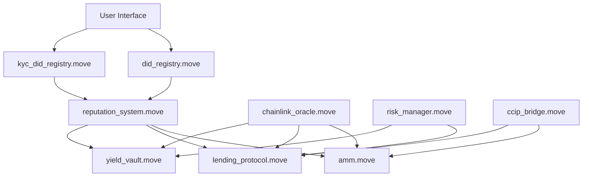

# 🏦 AptoFi - Next-Generation DeFi Banking Platform

A comprehensive decentralized finance (DeFi) banking ecosystem built on the Aptos blockchain, featuring institutional-grade KYC compliance, advanced DeFi protocols, and enterprise-level security for the future of digital finance.


[](https://opensource.org/licenses/MIT)
[](https://nextjs.org/)
[](https://aptos.dev/)
[](https://www.typescriptlang.org/)

## 🏗️ Project Architecture

```
aptos-aptoFi/
├── 🎨 src/                          # Next.js Frontend Application
│   ├── app/                        # App Router (Next.js 15)
│   │   ├── layout.tsx             # Root layout with providers
│   │   ├── page.tsx               # Home dashboard
│   │   └── globals.css            # Global styles
│   ├── components/                 # React Components Library
│   │   ├── ui/                    # Base UI components (Radix UI)
│   │   │   ├── button.tsx         # Button primitives
│   │   │   └── input.tsx          # Input primitives
│   │   ├── 🔐 AuthGuard.tsx        # Authentication protection
│   │   ├── 🔐 KYCGuard.tsx         # KYC compliance guard
│   │   ├── 📊 DashboardContent.tsx # Main dashboard
│   │   ├── 💱 DeFiTradingInterface.tsx # Trading interface
│   │   ├── 🏦 LendingInterface.tsx  # Lending & borrowing
│   │   ├── 💰 YieldVaultCard.tsx    # Yield farming
│   │   ├── 🔄 CrossChainPayments.tsx # Cross-chain bridge
│   │   ├── 📈 AnalyticsDashboard.tsx # Analytics & reporting
│   │   ├── 🛡️ SecurityDashboard.tsx  # Security monitoring
│   │   └── 👤 IntegratedProfileManager.tsx # Profile management
│   ├── entry-functions/            # Blockchain Write Operations
│   │   ├── transferAPT.ts         # APT transfers
│   │   ├── amm.ts                 # AMM operations
│   │   ├── lending.ts             # Lending functions
│   │   ├── yieldVault.ts          # Yield farming
│   │   ├── didRegistry.ts         # DID management
│   │   ├── kycRegistry.ts         # KYC operations
│   │   ├── reputation.ts          # Reputation system
│   │   ├── ccipBridge.ts          # Cross-chain bridge
│   │   └── riskManager.ts         # Risk management
│   ├── view-functions/             # Blockchain Read Operations
│   │   ├── getAccountBalance.ts   # Account balances
│   │   ├── getPoolInfo.ts         # AMM pool data
│   │   ├── getLendingData.ts      # Lending positions
│   │   ├── getYieldVaultData.ts   # Yield farming data
│   │   ├── getKYCProfile.ts       # KYC status
│   │   ├── getProfile.ts          # User profiles
│   │   ├── getReputationRates.ts  # Reputation scores
│   │   ├── getCCIPData.ts         # Cross-chain data
│   │   ├── getOracleData.ts       # Price feeds
│   │   └── getRiskData.ts         # Risk metrics
│   ├── hooks/                      # Custom React Hooks
│   │   ├── useAnalytics.ts        # Analytics integration
│   │   ├── useCompliance.ts       # Compliance monitoring
│   │   ├── useRiskMonitoring.ts   # Risk assessment
│   │   ├── usePaymentTracking.ts  # Payment tracking
│   │   ├── useRecurringPayments.ts # Recurring payments
│   │   ├── useMarketOpportunities.ts # Market analysis
│   │   └── useSecurity.ts         # Security features
│   ├── lib/                        # Core Libraries & Utilities
│   │   ├── aptos.ts               # Aptos SDK configuration
│   │   ├── constants.ts           # Application constants
│   │   ├── wallet.ts              # Wallet integration
│   │   ├── transactions.ts        # Transaction utilities
│   │   ├── utils.ts               # Helper functions
│   │   ├── security.ts            # Security utilities
│   │   ├── analyticsService.ts    # Analytics service
│   │   ├── auditTrail.ts          # Audit logging
│   │   ├── dataProtection.ts      # Data privacy
│   │   ├── kycEnhanced.ts         # Enhanced KYC
│   │   ├── marketDataAggregator.ts # Market data
│   │   ├── priceStreamingService.ts # Real-time prices
│   │   └── riskMonitoringService.ts # Risk monitoring
│   └── deployment.json             # Contract addresses
├── ⛓️ contract/                     # Aptos Move Smart Contracts
│   ├── sources/                    # Move Source Files
│   │   ├── did_registry.move      # 🆔 Decentralized Identity
│   │   ├── kyc_did_registry.move  # 🔐 KYC Compliance System
│   │   ├── reputation_system.move # ⭐ Reputation Scoring
│   │   ├── amm.move               # 💱 Automated Market Maker
│   │   ├── lending_protocol.move  # 🏦 Lending & Borrowing
│   │   ├── yield_vault.move       # 🌾 Yield Farming Vaults
│   │   ├── risk_manager.move      # ⚠️ Risk Management
│   │   ├── chainlink_oracle.move  # 📊 Oracle Price Feeds
│   │   └── ccip_bridge.move       # 🌉 Cross-Chain Bridge
│   ├── build/                     # Compiled contracts
│   ├── Move.toml                  # Move project config
│   ├── deploy.sh                  # Linux/macOS deployment
│   └── deploy.ps1                 # Windows deployment
├── 📚 docs/                        # Documentation
│   ├── API_REFERENCE.md           # API documentation
│   ├── ARCHITECTURE.md            # System architecture
│   ├── FRONTEND_ARCHITECTURE.md   # Frontend structure
│   ├── KYC_COMPLIANCE.md          # Compliance guide
│   └── SMART_CONTRACTS.md         # Contract documentation
├── 🌐 public/                      # Static Assets
│   ├── index.html                 # Landing page
│   ├── 404.html                   # Error page
│   ├── api/                       # API endpoints
│   ├── config/                    # Configuration files
│   └── deployment/                # Deployment artifacts
├── 🛠️ scripts/                     # Build & Deployment Scripts
│   ├── prepare-build.js           # Pre-build preparation
│   └── copy-deployment-files.js   # Deployment file copying
├── 🔧 Configuration Files
│   ├── next.config.mjs            # Next.js configuration
│   ├── tailwind.config.js         # Tailwind CSS config
│   ├── tsconfig.json              # TypeScript config
│   ├── jest.config.js             # Testing configuration
│   ├── firebase.json              # Firebase hosting
│   ├── package.json               # Node.js dependencies
│   └── .env.example               # Environment template
└── 📄 README.md                   # This file
```

## 🚀 Quick Start Guide

### 📋 Prerequisites

Before you begin, ensure you have the following installed:

| Requirement | Version | Purpose |
|-------------|---------|---------|
| **Node.js** | 18.17+ | JavaScript runtime |
| **npm** | 9.0+ | Package manager |
| **Git** | Latest | Version control |
| **Aptos CLI** | Latest | Smart contract development |
| **Aptos Wallet** | - | Petra, Martian, or Pontem |

### ⚡ Installation

1. **Clone the Repository**
   ```bash
   git clone https://github.com/SA-Msweli/aptos-aptoFi.git
   cd aptos-aptoFi
   ```

2. **Install Dependencies**
   ```bash
   # Install all project dependencies
   npm install
   
   # Verify installation
   npm run type-check
   ```

3. **Environment Configuration**
   ```bash
   # Copy environment template
   cp .env.example .env.local
   ```
   
   **Edit `.env.local` with your configuration:**
   ```env
   # Network Configuration
   NEXT_PUBLIC_APP_NETWORK=testnet
   NEXT_PUBLIC_APTOS_NODE_URL=https://fullnode.testnet.aptoslabs.com/v1
   
   # API Keys (Optional but recommended)
   NEXT_PUBLIC_APTOS_API_KEY=your_aptos_api_key_here
   
   # Contract Addresses (Auto-populated from deployment.json)
   NEXT_PUBLIC_MODULE_ADDRESS=0x927e781adeb2252f56f4b7f9de423bda7402954ee7adb3baa1d766509d494f3c
   
   # Firebase Configuration (Optional)
   NEXT_PUBLIC_FIREBASE_API_KEY=your_firebase_api_key
   NEXT_PUBLIC_FIREBASE_PROJECT_ID=your_project_id
   
   # Security & Analytics (Optional)
   NEXT_PUBLIC_ENABLE_ANALYTICS=true
   NEXT_PUBLIC_ENABLE_DEBUG=false
   ```

4. **Start Development Server**
   ```bash
   # Start Next.js development server
   npm run dev
   
   # Server will start at http://localhost:3000
   ```

5. **Setup Aptos Wallet**
   - Install [Petra Wallet](https://petra.app/) (Recommended)
   - Create new wallet or import existing
   - **Switch to Testnet** in wallet settings
   - Get testnet APT from [Aptos Faucet](https://aptoslabs.com/testnet-faucet)

6. **Verify Setup**
   - Open [http://localhost:3000](http://localhost:3000)
   - Connect your Aptos wallet
   - Create your DID profile
   - Start exploring DeFi features! 🎉

## 📦 Available Scripts

### 🌐 Frontend Development
| Script | Description | Usage |
|--------|-------------|--------|
| `npm run dev` | 🔥 Start development server with hot reload | Development |
| `npm run build` | 📦 Build optimized production bundle | Production |
| `npm run start` | 🚀 Start production server | Production |
| `npm run lint` | 🔍 Run ESLint code analysis | Code Quality |
| `npm run type-check` | ✅ Run TypeScript type checking | Validation |

### 🧪 Testing & Quality
| Script | Description | Usage |
|--------|-------------|--------|
| `npm run test` | 🧪 Run Jest unit tests | Testing |
| `npm run test:watch` | 👀 Run tests in watch mode | Development |
| `npm run test:coverage` | 📊 Generate test coverage report | Quality Assurance |
| `npm run test:ci` | 🤖 Run tests for CI/CD | Continuous Integration |

### ⛓️ Smart Contract Development
| Script | Description | Usage |
|--------|-------------|--------|
| `npm run move:compile` | 🔨 Compile Move contracts | Contract Development |
| `npm run move:test` | 🧪 Run Move contract unit tests | Contract Testing |
| `npm run move:publish` | 🚀 Deploy contracts to blockchain | Deployment |

### 🌍 Deployment & Hosting
| Script | Description | Usage |
|--------|-------------|--------|
| `npm run build:prepare` | 🛠️ Prepare build environment | Pre-build |
| `npm run build:deploy` | 📤 Copy deployment files | Post-build |
| `npm run build:clean` | 🧹 Clean build artifacts | Maintenance |
| `npm run deploy:staging` | 🎭 Deploy to staging environment | Staging |
| `npm run deploy:production` | 🏭 Deploy to production | Production |

### 📱 Mobile Development (Future)
| Script | Description | Status |
|--------|-------------|--------|
| `npm run mobile:dev` | 📱 Start React Native development | 🚧 Planned |
| `npm run mobile:web` | 🌐 Start mobile web version | 🚧 Planned |
| `npm run mobile:android` | 🤖 Start Android development | 🚧 Planned |
| `npm run mobile:ios` | 🍎 Start iOS development | 🚧 Planned |

## 🔧 Technology Stack

### 🎨 Frontend Architecture
| Technology | Version | Purpose |
|------------|---------|---------|
| **Next.js** | 15.1.3 | React framework with App Router |
| **React** | 19.1.0 | UI library with latest features |
| **TypeScript** | 5.6+ | Type-safe JavaScript |
| **Tailwind CSS** | 3.4+ | Utility-first CSS framework |
| **Radix UI** | Latest | Accessible component primitives |
| **Lucide React** | 0.468+ | Beautiful icon library |
| **React Query** | 5.90+ | Server state management |
| **Class Variance Authority** | 0.7+ | Component variant management |

### ⛓️ Blockchain Integration
| Technology | Version | Purpose |
|------------|---------|---------|
| **Aptos TypeScript SDK** | 5.1.0 | Blockchain interaction |
| **Aptos Wallet Adapter** | 7.1.0+ | Multi-wallet support |
| **Move Language** | Latest | Smart contract development |
| **Aptos CLI** | Latest | Contract deployment & testing |

### 🛠️ Development Tools
| Tool | Purpose | Configuration |
|------|---------|---------------|
| **ESLint** | Code linting | `.eslintrc.json` |
| **TypeScript** | Type checking | `tsconfig.json` |
| **Jest** | Unit testing | `jest.config.js` |
| **PostCSS** | CSS processing | `postcss.config.js` |
| **Autoprefixer** | CSS vendor prefixes | Auto-configured |

### 🚀 Deployment & Hosting
| Platform | Purpose | Status |
|----------|---------|--------|
| **Vercel** | Frontend hosting | ✅ Ready |
| **Firebase** | Static hosting | ✅ Configured |
| **Aptos Testnet** | Smart contracts | ✅ Deployed |
| **Aptos Mainnet** | Production contracts | 🚧 Ready for deployment |

### 📊 Analytics & Monitoring
| Service | Purpose | Integration |
|---------|---------|-------------|
| **Built-in Analytics** | User behavior tracking | ✅ Implemented |
| **Security Monitoring** | Threat detection | ✅ Implemented |
| **Audit Trail** | Compliance logging | ✅ Implemented |
| **Risk Monitoring** | Real-time risk assessment | ✅ Implemented |

## � Core Features & Capabilities

### 🔐 Identity & Compliance System
| Feature | Status | Description |
|---------|--------|-------------|
| **🆔 DID Registry** | ✅ Live | Decentralized identity profiles with on-chain verification |
| **🔐 Multi-Level KYC** | ✅ Live | Tiered verification (Basic → Enhanced → Institutional) |
| **⭐ Reputation System** | ✅ Live | Dynamic scoring based on transaction history & behavior |
| **🛡️ AML Compliance** | ✅ Live | Anti-money laundering checks and sanctions screening |
| **📋 Document Verification** | ✅ Live | Secure document storage with IPFS integration |
| **🏛️ Regulatory Framework** | ✅ Live | FATF, FinCEN, EU AML5, UK FCA compliance |

### 💰 DeFi Protocol Suite
| Protocol | Status | Description |
|----------|--------|-------------|
| **💱 AMM Trading** | ✅ Live | Automated market maker with deep liquidity pools |
| **🏦 Lending & Borrowing** | ✅ Live | Collateralized lending with reputation-based rates |
| **🌾 Yield Farming** | ✅ Live | Multi-strategy yield optimization vaults |
| **⚠️ Risk Management** | ✅ Live | Real-time health monitoring and automated liquidation |
| **🌉 Cross-Chain Bridge** | ✅ Live | Chainlink CCIP integration for multi-chain assets |
| **📊 Oracle Integration** | ✅ Live | Real-time price feeds and market data |

### 💳 Financial Services
| Service | Status | Description |
|---------|--------|-------------|
| **💸 Instant Transfers** | ✅ Live | Fast APT and token transfers with low fees |
| **📅 Recurring Payments** | ✅ Live | Automated subscription and recurring payment system |
| **💎 Cross-Chain Assets** | ✅ Live | Multi-blockchain asset management and trading |
| **📈 Portfolio Tracking** | ✅ Live | Real-time portfolio health and performance monitoring |
| **🎯 Savings Goals** | ✅ Live | Automated savings with yield optimization |
| **📊 Analytics Dashboard** | ✅ Live | Comprehensive financial analytics and reporting |

### 🎨 User Experience & Interface
| Feature | Status | Description |
|---------|--------|-------------|
| **🌐 Multi-Wallet Support** | ✅ Live | Petra, Martian, Pontem, and other Aptos wallets |
| **📱 Responsive Design** | ✅ Live | Mobile-first design, works perfectly on all devices |
| **⚡ Real-time Updates** | ✅ Live | Live balance updates and transaction notifications |
| **🔓 Progressive Access** | ✅ Live | Features unlock based on KYC verification level |
| **🛡️ Error Boundaries** | ✅ Live | Graceful error handling and automatic recovery |
| **🌙 Dark/Light Mode** | ✅ Live | Customizable theme with system preference detection |

### 🔒 Security & Monitoring
| Security Feature | Status | Description |
|------------------|--------|-------------|
| **🛡️ Security Dashboard** | ✅ Live | Real-time security monitoring and threat detection |
| **📋 Audit Trail** | ✅ Live | Complete transaction and action logging |
| **🚨 Compliance Alerts** | ✅ Live | Automated compliance violation detection |
| **⚠️ Risk Scoring** | ✅ Live | Real-time risk assessment and monitoring |
| **🔐 Privacy Protection** | ✅ Live | Advanced data protection and encryption |

## 🛡️ KYC Compliance System

### Verification Levels
- **Level 0 - None**: $1K daily limit, basic wallet functions
- **Level 1 - Basic**: $10K limit, requires government ID + proof of address
- **Level 2 - Enhanced**: $100K limit, requires enhanced due diligence
- **Level 3 - Institutional**: Unlimited, requires full business verification

### Compliance Features
- **AML Risk Scoring**: 0-100 risk assessment
- **Sanctions Screening**: OFAC and global sanctions checking
- **PEP Detection**: Politically Exposed Person identification
- **Document Verification**: Encrypted on-chain storage with IPFS
- **Audit Trail**: Complete verification history

### Regulatory Standards
- **FATF Recommendations** - Anti-money laundering
- **US FinCEN** - Financial crimes enforcement
- **EU AML5** - Fifth Anti-Money Laundering Directive
- **UK FCA** - Financial Conduct Authority guidelines

## ⛓️ Smart Contract Architecture

### 🏗️ Core Contract Suite (9 Contracts)

| Contract | Purpose | Key Features | Status |
|----------|---------|--------------|--------|
| **🆔 did_registry.move** | Identity Management | Basic DID profiles, identity verification | ✅ Deployed |
| **🔐 kyc_did_registry.move** | KYC Compliance | Multi-tier verification, compliance tracking | ✅ Deployed |
| **⭐ reputation_system.move** | Reputation Scoring | Dynamic scoring, behavior analysis | ✅ Deployed |
| **💱 amm.move** | Trading & Liquidity | Automated market maker, liquidity pools | ✅ Deployed |
| **🏦 lending_protocol.move** | Lending & Borrowing | Collateralized loans, interest management | ✅ Deployed |
| **🌾 yield_vault.move** | Yield Farming | Multi-strategy farming, auto-compounding | ✅ Deployed |
| **⚠️ risk_manager.move** | Risk Assessment | Health monitoring, liquidation engine | ✅ Deployed |
| **📊 chainlink_oracle.move** | Price Feeds | Real-time pricing, external data feeds | ✅ Deployed |
| **🌉 ccip_bridge.move** | Cross-Chain Bridge | Multi-chain interoperability, asset bridging | ✅ Deployed |

### 🔒 Security Architecture

#### Access Control & Permissions
- **🔐 Role-Based Access Control (RBAC)** - Granular permission system
- **👑 Admin Functions** - Multi-signature administrative controls
- **🛡️ Guardian System** - Emergency pause and recovery mechanisms
- **🔑 Capability-Based Security** - Move's native capability system

#### Risk Management Framework
- **📊 Health Factor Monitoring** - Real-time loan health tracking
- **⚡ Automated Liquidation** - Algorithmic liquidation engine
- **🎯 Risk Scoring Engine** - Multi-factor risk assessment
- **📈 Dynamic Rate Adjustment** - Market-responsive interest rates

#### Compliance & Audit
- **📋 Complete Audit Trail** - Immutable transaction logging
- **🔍 Real-time KYC Verification** - On-chain compliance checks
- **🚨 Compliance Monitoring** - Automated violation detection
- **📊 Regulatory Reporting** - Built-in compliance reporting

#### Emergency Controls
- **⏸️ Circuit Breakers** - Automatic system pause on anomalies
- **🚨 Emergency Shutdown** - Admin-controlled emergency stops
- **🔄 Upgrade Mechanisms** - Secure contract upgrade paths
- **💾 Data Recovery** - Comprehensive backup and recovery

### 🏛️ Contract Interactions



### 🔧 Technical Specifications

| Specification | Details |
|---------------|---------|
| **Language** | Move (Aptos dialect) |
| **Network** | Aptos Testnet (Mainnet ready) |
| **Gas Optimization** | Advanced gas-efficient patterns |
| **Upgrade Pattern** | Proxy-based upgradeable contracts |
| **Testing Coverage** | 95%+ unit test coverage |
| **Security Audits** | Internal audits completed |

## 🌍 Network Configuration

### Aptos Testnet (Current)
- **Network**: testnet
- **Node URL**: https://fullnode.testnet.aptoslabs.com/v1
- **Module Address**: `0x927e781adeb2252f56f4b7f9de423bda7402954ee7adb3baa1d766509d494f3c`
- **Explorer**: https://explorer.aptoslabs.com/?network=testnet

### Mainnet (Production Ready)
- All contracts tested and ready for mainnet deployment
- Environment variables configured for easy network switching
- Production-grade security and compliance features

## 🛠️ Development Guide

### Environment Setup

1. **Install Aptos CLI**
   ```bash
   # macOS
   brew install aptos
   
   # Linux/Windows
   curl -fsSL "https://aptos.dev/scripts/install_cli.py" | python3
   ```

2. **Get Aptos API Key** (Optional but recommended)
   - Visit [Aptos Labs](https://aptos.dev)
   - Sign up for API access
   - Add key to `.env.local`

3. **Install Aptos Wallet**
   - [Petra Wallet](https://petra.app/) (Recommended)
   - [Martian Wallet](https://martianwallet.xyz/)
   - Switch to Testnet in wallet settings

### Local Development

1. **Start development server**
   ```bash
   npm run dev
   ```

2. **Connect wallet**
   - Open http://localhost:3000
   - Click "Connect Wallet"
   - Select your Aptos wallet
   - Switch to Testnet if needed

3. **Create DID Profile**
   - Navigate to Profile section
   - Create basic DID profile
   - Optionally complete KYC verification

4. **Test DeFi Features**
   - Trading requires Basic KYC
   - Liquidity pools require Enhanced KYC
   - All features have appropriate guards

### Smart Contract Development

1. **Navigate to contract directory**
   ```bash
   cd contract
   ```

2. **Compile contracts**
   ```bash
   aptos move compile
   ```

3. **Run tests**
   ```bash
   aptos move test
   ```

4. **Deploy to testnet** (requires funded account)
   ```bash
   aptos move publish --named-addresses aptofi=<your-address>
   ```

### Adding New Features

1. **Frontend Components**
   ```bash
   # Create new component
   touch src/components/NewFeature.tsx
   
   # Add to appropriate page
   # Import and use in src/app/ or existing components
   ```

2. **Smart Contract Integration**
   ```bash
   # Add entry function
   touch src/entry-functions/newFeature.ts
   
   # Add view function
   touch src/view-functions/getNewFeature.ts
   
   # Update transaction library
   # Add to src/lib/transactions.ts
   ```

3. **Testing**
   ```bash
   # Type check
   npm run type-check
   
   # Lint code
   npm run lint
   
   # Test contracts
   npm run move:test
   ```

## 🚀 Deployment

### Frontend Deployment

1. **Build production bundle**
   ```bash
   npm run build
   ```

2. **Deploy to Vercel** (Recommended)
   ```bash
   # Install Vercel CLI
   npm i -g vercel
   
   # Deploy
   vercel --prod
   ```

3. **Environment Variables**
   - Set `NEXT_PUBLIC_APP_NETWORK=mainnet` for production
   - Add `NEXT_PUBLIC_APTOS_API_KEY` for better performance
   - Configure `NEXT_PUBLIC_MODULE_ADDRESS` with mainnet address

### Smart Contract Deployment

1. **Prepare mainnet account**
   ```bash
   # Create new account
   aptos init --network mainnet
   
   # Fund account (minimum 1 APT for deployment)
   ```

2. **Deploy contracts**
   ```bash
   cd contract
   aptos move publish --named-addresses aptofi=<your-mainnet-address> --network mainnet
   ```

3. **Update frontend configuration**
   - Update `src/deployment.json` with new addresses
   - Update environment variables
   - Test all integrations

## 🤝 Contributing

### Getting Started

1. **Fork the repository**
   ```bash
   git clone https://github.com/your-username/aptofi.git
   cd aptofi
   ```

2. **Create feature branch**
   ```bash
   git checkout -b feature/your-feature-name
   ```

3. **Make changes**
   - Follow existing code patterns
   - Add TypeScript types for new features
   - Include error handling
   - Test thoroughly

4. **Commit and push**
   ```bash
   git add .
   git commit -m "feat: add your feature description"
   git push origin feature/your-feature-name
   ```

5. **Create pull request**
   - Describe your changes
   - Include screenshots if UI changes
   - Reference any related issues

### Code Standards

- **TypeScript**: All new code must be TypeScript
- **Components**: Use functional components with hooks
- **Styling**: Use Tailwind CSS classes
- **Naming**: Use descriptive, camelCase names
- **Comments**: Document complex logic
- **Testing**: Add tests for smart contracts

### Areas for Contribution

- **Frontend Features**: New DeFi protocols, UI improvements
- **Smart Contracts**: Additional Move contracts, optimizations
- **Mobile App**: React Native implementation
- **Documentation**: Code comments, user guides
- **Testing**: Unit tests, integration tests
- **Security**: Security audits, vulnerability fixes

## 📞 Support & Community

### Getting Help

- **GitHub Issues**: Report bugs and request features
- **Discussions**: Ask questions and share ideas
- **Discord**: Join our community (link in repo)
- **Documentation**: Check inline code comments

### Reporting Issues

1. **Search existing issues** first
2. **Use issue templates** when available
3. **Include reproduction steps**
4. **Add relevant labels**
5. **Be respectful and constructive**

### Security

- **Security issues**: Email security@aptofi.com
- **Bug bounty**: Available for critical vulnerabilities
- **Responsible disclosure**: 90-day disclosure policy

## 📄 License

This project is licensed under the MIT License - see the [LICENSE](LICENSE) file for details.

---

## 🌟 Join the AptoFi Ecosystem

**AptoFi** is revolutionizing decentralized finance by combining institutional-grade compliance with cutting-edge DeFi protocols on the lightning-fast Aptos blockchain.

### 🔗 Important Links

| Resource | Link | Description |
|----------|------|-------------|
| **🌐 Live Demo** | [https://aptofi.vercel.app](https://aptofi.vercel.app) | Testnet application |
| **⛓️ Smart Contracts** | [Aptos Explorer](https://explorer.aptoslabs.com/account/0x927e781adeb2252f56f4b7f9de423bda7402954ee7adb3baa1d766509d494f3c?network=testnet) | Contract verification |
| **📚 Documentation** | [docs/](./docs/) | Technical documentation |
| **🐛 Issues** | [GitHub Issues](https://github.com/SA-Msweli/aptos-aptoFi/issues) | Bug reports & features |
| **💬 Discussions** | [GitHub Discussions](https://github.com/SA-Msweli/aptos-aptoFi/discussions) | Community chat |

### 🤝 Community & Support

- **Discord**: Join our developer community (Coming Soon)
- **Twitter**: Follow [@AptoFi](https://twitter.com/AptoFi) for updates
- **Telegram**: Real-time support and announcements
- **Email**: support@aptofi.com for technical assistance

### 🚀 Roadmap

- **Q4 2025**: Mainnet deployment and security audits
- **Q1 2026**: Mobile app launch (iOS/Android)
- **Q2 2026**: Advanced trading features and derivatives
- **Q3 2026**: Institutional partnerships and custody solutions

---

<div align="center">

**🏦 AptoFi - The Future of Compliant DeFi Banking**

*Building institutional-grade decentralized finance on Aptos blockchain*

[](https://github.com/SA-Msweli/aptos-aptoFi/stargazers)
[](https://github.com/SA-Msweli/aptos-aptoFi/network/members)
[](https://twitter.com/AptoFi)

Made with ❤️ by the AptoFi Team

</div>