# AptoFi System Architecture

## Overview

AptoFi is a comprehensive DeFi banking platform built on Aptos blockchain with institutional-grade KYC compliance. The system consists of multiple layers working together to provide secure, compliant, and scalable DeFi services.

## System Components

### Frontend Layer
- **Next.js 15 Application** - Modern React-based web interface
- **TypeScript** - Type-safe development
- **Tailwind CSS** - Utility-first styling
- **Aptos Wallet Integration** - Multi-wallet support

### Smart Contract Layer
- **9 Move Contracts** - Comprehensive DeFi protocol suite
- **Aptos Blockchain** - High-performance L1 blockchain
- **Event-Driven Architecture** - Real-time updates and monitoring

### Integration Layer
- **Aptos TypeScript SDK** - Blockchain interaction
- **IPFS** - Decentralized document storage
- **Chainlink Oracles** - External data feeds

## Architecture Diagrams

### System Overview (Mermaid)

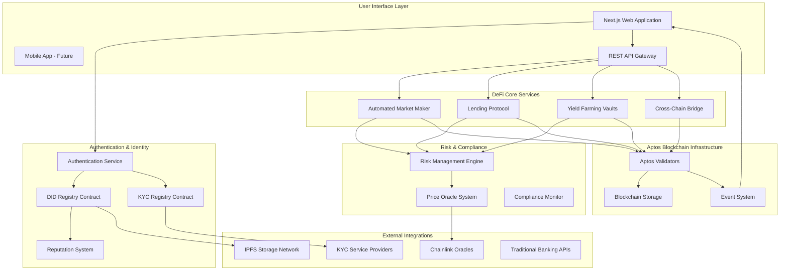

### Data Flow Architecture (Mermaid)

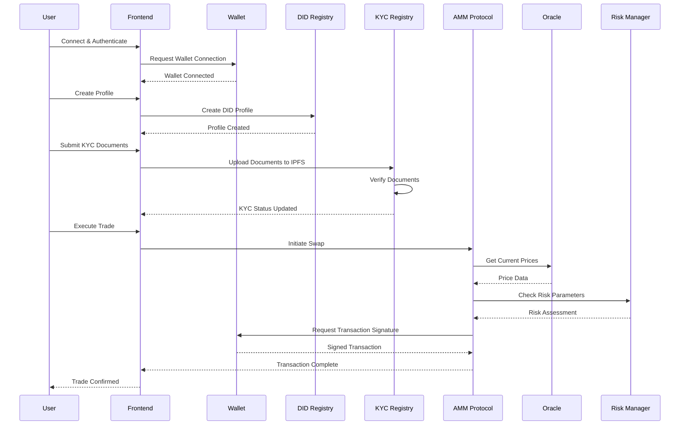

### High-Level System Architecture

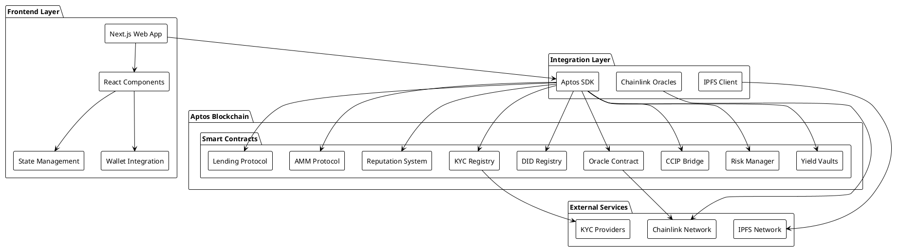

### Smart Contract Architecture

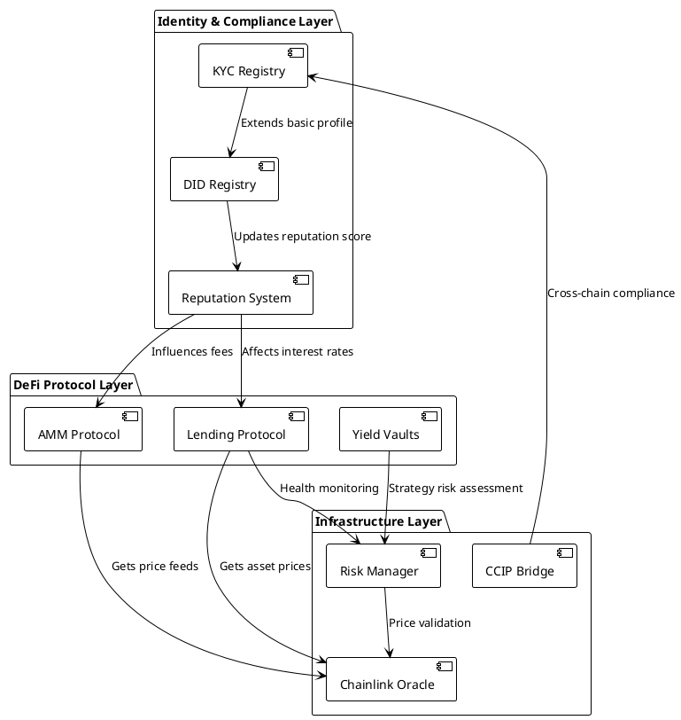

### User Journey Flow

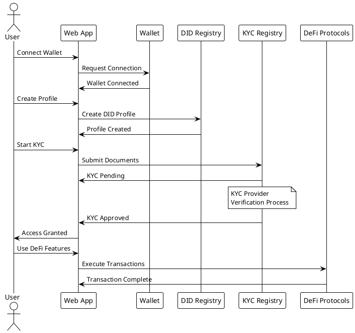

## Data Flow Architecture

### Authentication & Authorization Flow

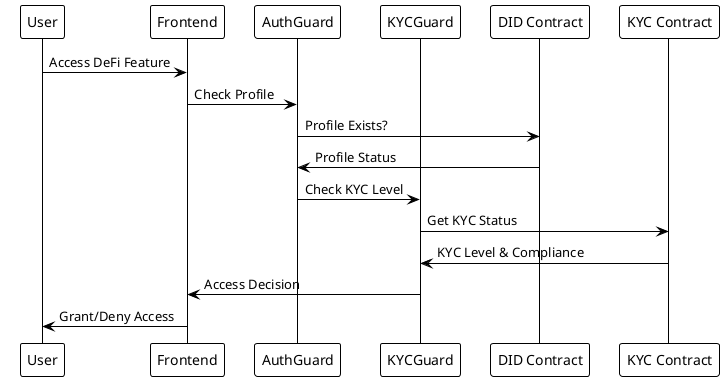

### Transaction Processing Flow

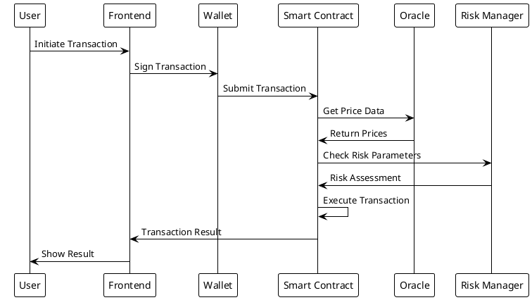

## Component Interactions

### Frontend Component Hierarchy (Mermaid)

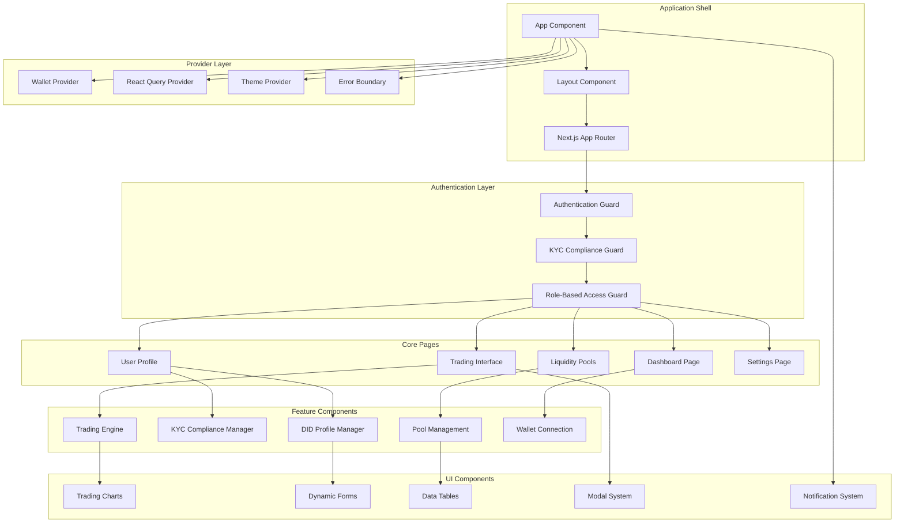

### Frontend Component Hierarchy (PlantUML)

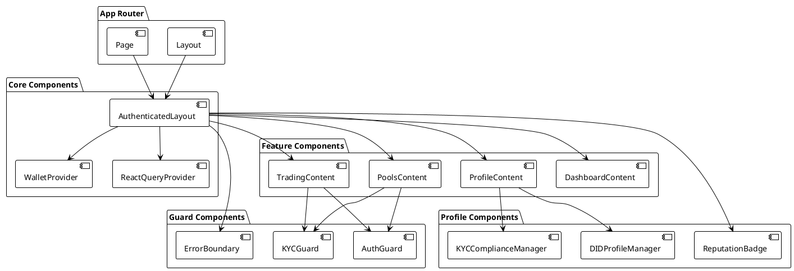

## Security Architecture

### Access Control Matrix

| Component | No Profile | Basic KYC | Enhanced KYC | Institutional KYC |
|-----------|------------|-----------|--------------|-------------------|
| Wallet Functions | ✅ | ✅ | ✅ | ✅ |
| Basic Trading | ❌ | ✅ | ✅ | ✅ |
| High-Value Trading | ❌ | ❌ | ✅ | ✅ |
| Liquidity Pools | ❌ | ❌ | ✅ | ✅ |
| Lending/Borrowing | ❌ | ❌ | ✅ | ✅ |
| Cross-Chain Bridge | ❌ | ❌ | ✅ | ✅ |
| Institutional Features | ❌ | ❌ | ❌ | ✅ |

### Security Layers

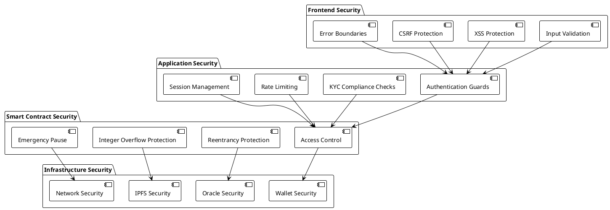

## Scalability Considerations

### Horizontal Scaling

- **Frontend**: CDN distribution, edge caching
- **API Layer**: Load balancing, microservices
- **Blockchain**: Aptos parallel execution
- **Storage**: IPFS distributed storage

### Performance Optimization

- **Frontend**: Code splitting, lazy loading, caching
- **Smart Contracts**: Gas optimization, batch operations
- **Data Fetching**: React Query caching, pagination
- **Network**: Connection pooling, request batching

### Future Scaling Plans

1. **Layer 2 Integration** - For high-frequency trading
2. **Multi-Chain Support** - Expand beyond Aptos
3. **Mobile Applications** - Native iOS/Android apps
4. **API Gateway** - Centralized API management
5. **Microservices** - Service decomposition for scale

## Deployment Architecture

### Development Environment

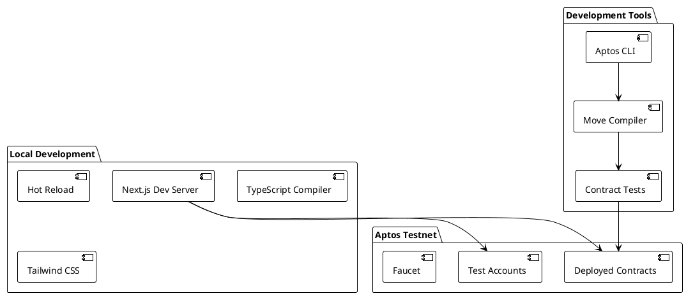

### Production Environment

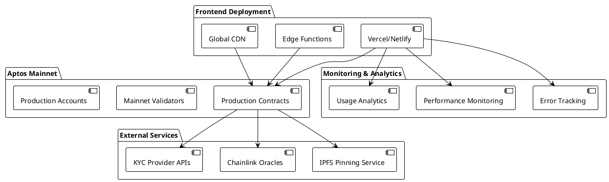

## Integration Points

### External Service Integration

1. **Aptos Blockchain**
   - RPC endpoints for transaction submission
   - Event streaming for real-time updates
   - Account and resource queries

2. **IPFS Network**
   - Document storage and retrieval
   - Content addressing and verification
   - Pinning services for availability

3. **Chainlink Oracles**
   - Price feed aggregation
   - External data validation
   - Decentralized oracle network

4. **KYC Providers**
   - Identity verification services
   - Document validation APIs
   - Compliance screening services

### API Specifications

#### Aptos Integration
- **SDK Version**: 5.1.0
- **Network**: Testnet/Mainnet
- **Authentication**: Wallet signatures
- **Rate Limits**: API key dependent

#### IPFS Integration
- **Protocol**: HTTP API
- **Storage**: Encrypted documents
- **Retrieval**: Content hash addressing
- **Pinning**: Persistent storage

## Monitoring & Observability

### Key Metrics

1. **User Metrics**
   - Active users (daily/monthly)
   - KYC completion rates
   - Feature adoption rates

2. **Transaction Metrics**
   - Transaction volume
   - Success/failure rates
   - Gas usage optimization

3. **System Metrics**
   - Response times
   - Error rates
   - Uptime/availability

4. **Security Metrics**
   - Failed authentication attempts
   - Compliance violations
   - Risk score distributions

### Alerting Strategy

- **Critical**: System downtime, security breaches
- **Warning**: High error rates, performance degradation
- **Info**: Feature usage, user milestones

This architecture provides a solid foundation for a scalable, secure, and compliant DeFi banking platform while maintaining flexibility for future enhancements and integrations.