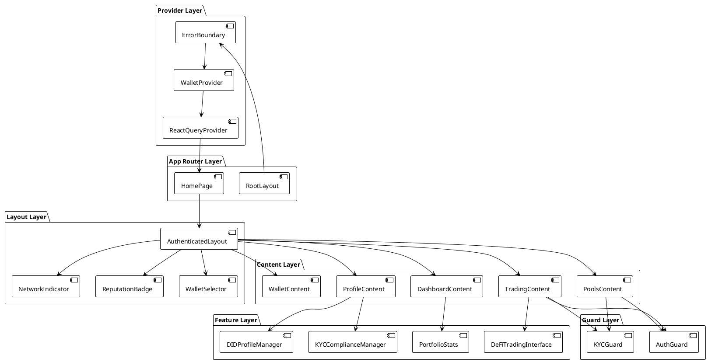
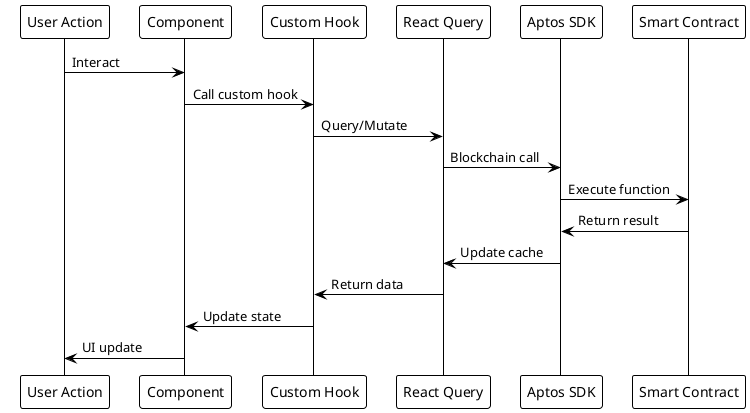
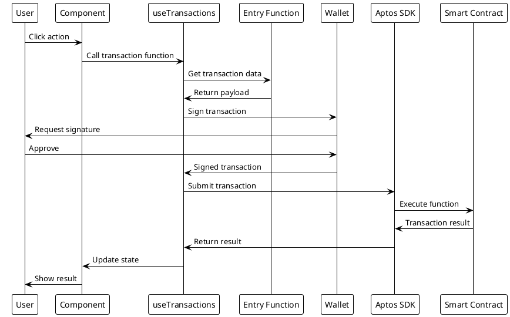
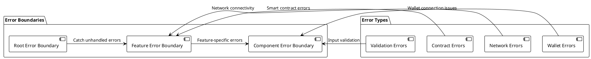
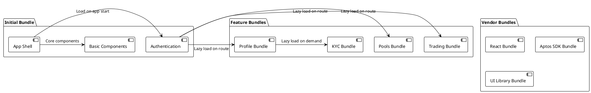
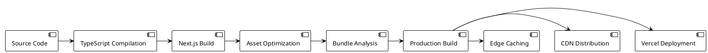

# Frontend Architecture

## Overview

AptoFi's frontend is built with Next.js 15, TypeScript, and Tailwind CSS, providing a modern, responsive, and type-safe user interface for DeFi banking operations with comprehensive KYC compliance.

## Technology Stack

### Core Framework
- **Next.js 15** - React framework with App Router
- **React 19** - Latest React with concurrent features
- **TypeScript** - Type-safe development
- **Tailwind CSS** - Utility-first styling framework

### Blockchain Integration
- **Aptos TypeScript SDK 5.1.0** - Blockchain interaction
- **Aptos Wallet Adapter** - Multi-wallet support
- **React Query** - Server state management and caching

### UI Components
- **Radix UI** - Accessible component primitives
- **Lucide React** - Icon library
- **Custom Components** - Domain-specific UI components

## Project Structure

```
src/
├── app/                          # Next.js App Router
│   ├── layout.tsx               # Root layout with providers
│   ├── page.tsx                 # Home page
│   └── globals.css              # Global styles
├── components/                   # React components
│   ├── ui/                      # Base UI components (Radix UI)
│   ├── AuthGuard.tsx            # Profile-based access control
│   ├── KYCGuard.tsx             # KYC compliance protection
│   ├── AuthenticatedLayout.tsx  # Main app layout
│   ├── DashboardContent.tsx     # Dashboard interface
│   ├── DIDProfileManager.tsx    # DID profile management
│   ├── KYCComplianceManager.tsx # KYC verification interface
│   ├── WalletProvider.tsx       # Wallet connection provider
│   ├── ReactQueryProvider.tsx   # React Query setup
│   └── ...                     # Other feature components
├── entry-functions/             # Smart contract interactions
│   ├── didRegistry.ts           # DID contract functions
│   ├── kycRegistry.ts           # KYC contract functions
│   ├── reputation.ts            # Reputation contract functions
│   ├── amm.ts                   # AMM contract functions
│   └── transferAPT.ts           # Basic transfer functions
├── view-functions/              # Blockchain data fetching
│   ├── getProfile.ts            # Profile data fetching
│   ├── getKYCProfile.ts         # KYC data fetching
│   └── getAccountBalance.ts     # Balance queries
├── hooks/                       # Custom React hooks
│   └── useProfileStatus.ts      # Profile status management
├── lib/                         # Utilities and configurations
│   ├── aptos.ts                 # Aptos client configuration
│   ├── constants.ts             # App constants
│   ├── transactions.ts          # Transaction utilities
│   ├── wallet.ts                # Wallet utilities
│   └── utils.ts                 # General utilities
└── deployment.json              # Contract deployment addresses
```

## Component Architecture

### Component Hierarchy



### State Management Flow



## Core Components

### 1. Authentication & Authorization

#### AuthGuard Component
```typescript
interface AuthGuardProps {
  children: ReactNode;
  requireProfile?: boolean;
  fallback?: ReactNode;
}
```

**Purpose**: Protects routes that require basic DID profile
**Features**:
- Profile existence validation
- Loading states
- Fallback UI for unauthorized access
- Integration with profile status hook

#### KYCGuard Component
```typescript
interface KYCGuardProps {
  children: ReactNode;
  requiredLevel?: number;
  operationType?: string;
  fallback?: ReactNode;
}
```

**Purpose**: Enforces KYC compliance for DeFi operations
**Features**:
- Multi-level KYC verification
- Operation-specific requirements
- Compliance status checking
- User guidance for verification

### 2. Layout & Navigation

#### AuthenticatedLayout Component
**Purpose**: Main application layout with navigation
**Features**:
- Responsive sidebar navigation
- Mobile bottom navigation
- Header with wallet connection
- Section-based content rendering

**Navigation Sections**:
- Dashboard - Portfolio overview
- Wallet - Send/receive functions
- Trading - Token swapping (requires Basic KYC)
- Pools - Liquidity provision (requires Enhanced KYC)
- Profile - DID and KYC management

### 3. Profile Management

#### DIDProfileManager Component
**Purpose**: Comprehensive DID profile management
**Features**:
- Profile creation and updates
- Metadata management
- Reputation system integration
- Real-time status updates

#### KYCComplianceManager Component
**Purpose**: KYC verification and compliance management
**Features**:
- Multi-level verification process
- Document upload and management
- Compliance status tracking
- Risk assessment display

### 4. DeFi Interfaces

#### DeFiTradingInterface Component
**Purpose**: Token trading and swapping interface
**Features**:
- AMM-based token swapping
- Slippage protection
- Gas estimation
- Transaction status tracking

#### LiquidityInterface Component
**Purpose**: Liquidity pool management
**Features**:
- Add/remove liquidity
- LP token management
- Pool statistics
- Yield tracking

## Data Flow Architecture

### Blockchain Data Flow

```plantuml
@startuml Data_Flow
!theme plain
skinparam backgroundColor #FFFFFF

package "Frontend Layer" {
  [React Components] as Components
  [Custom Hooks] as Hooks
  [React Query] as Query
}

package "Integration Layer" {
  [Entry Functions] as Entry
  [View Functions] as View
  [Aptos SDK] as SDK
}

package "Blockchain Layer" {
  [Smart Contracts] as Contracts
  [Aptos Network] as Network
}

Components -> Hooks: "Use hooks"
Hooks -> Query: "Query/Mutate"
Query -> Entry: "Write operations"
Query -> View: "Read operations"
Entry -> SDK: "Submit transactions"
View -> SDK: "Query data"
SDK -> Contracts: "Contract calls"
Contracts -> Network: "Blockchain state"

Network -> Contracts: "State updates"
Contracts -> SDK: "Return data"
SDK -> View: "Query results"
SDK -> Entry: "Transaction results"
View -> Query: "Cache data"
Entry -> Query: "Update cache"
Query -> Hooks: "Return state"
Hooks -> Components: "Update UI"

@enduml
```

### Transaction Processing



## Custom Hooks

### useProfileStatus Hook
```typescript
interface ProfileStatus {
  profile: UserProfile | null;
  hasProfile: boolean;
  isActive: boolean;
  isLoading: boolean;
  error: string | null;
  refetch: () => Promise<void>;
}
```

**Purpose**: Centralized profile status management
**Features**:
- Real-time profile status
- Automatic refetching
- Error handling
- Loading states

### useTransactions Hook
```typescript
interface TransactionResult {
  hash: string;
  success: boolean;
  gasUsed?: number;
  errorMessage?: string;
}
```

**Purpose**: Unified transaction management
**Features**:
- Transaction execution
- Gas estimation
- Status tracking
- Error handling

## Styling Architecture

### Tailwind CSS Configuration

```javascript
module.exports = {
  darkMode: ["class"],
  content: [
    './pages/**/*.{ts,tsx}',
    './components/**/*.{ts,tsx}',
    './app/**/*.{ts,tsx}',
    './src/**/*.{ts,tsx}',
  ],
  theme: {
    extend: {
      colors: {
        // Custom color palette
        primary: "hsl(var(--primary))",
        secondary: "hsl(var(--secondary))",
        // ... other colors
      },
      // Custom animations and utilities
    },
  },
  plugins: [require("tailwindcss-animate")],
}
```

### Component Styling Patterns

1. **Utility-First Approach**
   - Tailwind classes for styling
   - Consistent spacing and colors
   - Responsive design utilities

2. **Component Variants**
   - Class Variance Authority for variants
   - Consistent button and input styles
   - Theme-aware components

3. **Animation System**
   - Tailwind CSS animations
   - Loading states and transitions
   - Micro-interactions

## Error Handling

### Error Boundary Strategy



### Error Recovery Mechanisms

1. **Automatic Retry**
   - Network request retries
   - Transaction resubmission
   - Connection recovery

2. **Fallback UI**
   - Error state components
   - Offline indicators
   - Retry buttons

3. **User Guidance**
   - Clear error messages
   - Action suggestions
   - Help documentation links

## Performance Optimization

### Code Splitting Strategy



### Caching Strategy

1. **React Query Caching**
   - Blockchain data caching
   - Stale-while-revalidate
   - Background updates

2. **Browser Caching**
   - Static asset caching
   - Service worker caching
   - Local storage for preferences

3. **CDN Caching**
   - Global edge caching
   - Asset optimization
   - Compression

## Security Considerations

### Frontend Security Measures

1. **Input Validation**
   - Client-side validation
   - Type checking with TypeScript
   - Sanitization of user inputs

2. **Wallet Security**
   - Secure wallet connection
   - Transaction verification
   - Private key protection

3. **Data Protection**
   - No sensitive data in localStorage
   - Encrypted communication
   - Secure API endpoints

### XSS Prevention

1. **Content Security Policy**
   - Strict CSP headers
   - Script source restrictions
   - Inline script prevention

2. **Input Sanitization**
   - HTML sanitization
   - URL validation
   - File upload restrictions

## Testing Strategy

### Component Testing

```typescript
// Example component test
describe('KYCGuard', () => {
  it('should allow access with valid KYC level', () => {
    render(
      <KYCGuard requiredLevel={KYC_LEVELS.BASIC}>
        <div>Protected Content</div>
      </KYCGuard>
    );
    expect(screen.getByText('Protected Content')).toBeInTheDocument();
  });
});
```

### Integration Testing

1. **Wallet Integration**
   - Connection flow testing
   - Transaction signing
   - Error handling

2. **Smart Contract Integration**
   - Contract call testing
   - Data fetching validation
   - Error scenario testing

### End-to-End Testing

1. **User Flows**
   - Complete onboarding flow
   - DeFi operation flows
   - Error recovery flows

2. **Cross-Browser Testing**
   - Chrome, Firefox, Safari
   - Mobile browser testing
   - Wallet compatibility

## Deployment Architecture

### Build Process



### Environment Configuration

1. **Development**
   - Hot reload enabled
   - Source maps included
   - Debug logging active

2. **Staging**
   - Production build
   - Testnet configuration
   - Performance monitoring

3. **Production**
   - Optimized build
   - Mainnet configuration
   - Error tracking
   - Analytics integration

## Monitoring & Analytics

### Performance Monitoring

1. **Core Web Vitals**
   - Largest Contentful Paint (LCP)
   - First Input Delay (FID)
   - Cumulative Layout Shift (CLS)

2. **Custom Metrics**
   - Wallet connection time
   - Transaction success rate
   - Page load performance

### User Analytics

1. **Feature Usage**
   - Component interaction tracking
   - User journey analysis
   - Conversion funnel metrics

2. **Error Tracking**
   - JavaScript error monitoring
   - Transaction failure tracking
   - User experience issues

This frontend architecture provides a robust, scalable, and user-friendly interface for AptoFi's DeFi banking platform while maintaining security, performance, and accessibility standards.