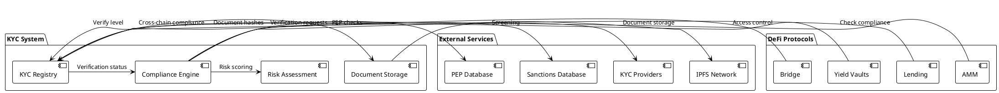
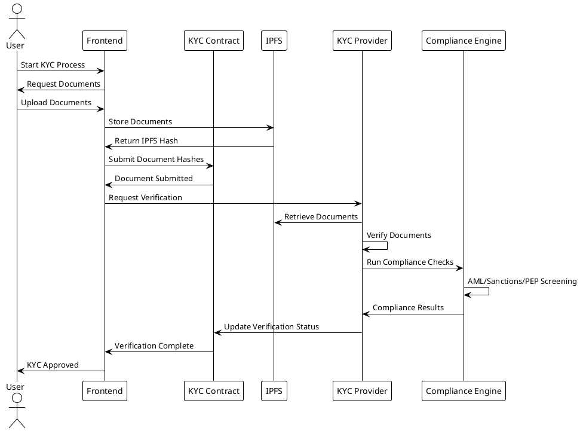
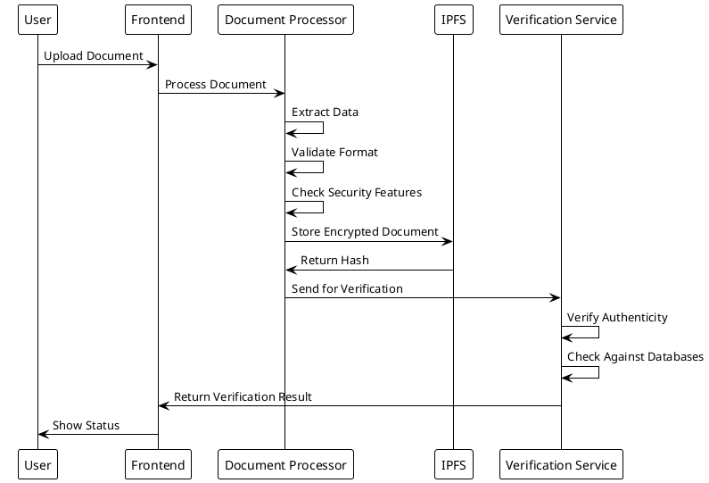
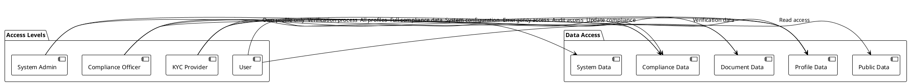

# KYC Compliance System

## Overview

AptoFi implements a comprehensive Know Your Customer (KYC) compliance system designed to meet global regulatory requirements for DeFi platforms. The system provides multi-level identity verification with on-chain compliance tracking while maintaining user privacy and decentralization principles.

## Regulatory Framework

### Global Compliance Standards

AptoFi's KYC system is designed to comply with major international regulations:

- **FATF Recommendations** - Financial Action Task Force anti-money laundering standards
- **US FinCEN** - Financial Crimes Enforcement Network requirements
- **EU AML5** - Fifth Anti-Money Laundering Directive
- **UK FCA** - Financial Conduct Authority guidelines
- **Singapore MAS** - Monetary Authority of Singapore regulations
- **Canada FINTRAC** - Financial Transactions and Reports Analysis Centre

### Regulatory Requirements Met

1. **Customer Due Diligence (CDD)**
   - Identity verification
   - Address verification
   - Source of funds verification

2. **Enhanced Due Diligence (EDD)**
   - Higher risk customer screening
   - Politically Exposed Person (PEP) checks
   - Sanctions screening

3. **Ongoing Monitoring**
   - Transaction monitoring
   - Periodic review requirements
   - Suspicious activity reporting

## KYC Verification Levels

### Level 0 - No Verification
**Access**: Limited wallet functions only
**Limits**: 
- Daily: $1,000
- Monthly: $5,000
- Annual: $10,000

**Requirements**: None
**Features Available**:
- Wallet connection
- Basic profile creation
- View-only access to platform

### Level 1 - Basic Verification
**Access**: Standard DeFi operations
**Limits**:
- Daily: $10,000
- Monthly: $50,000
- Annual: $100,000

**Requirements**:
- Government-issued photo ID (passport, driver's license, national ID)
- Proof of address (utility bill, bank statement, government document)
- Selfie verification with liveness detection

**Features Available**:
- Token trading and swapping
- Basic lending and borrowing
- Yield farming (limited pools)
- Cross-chain transfers (limited amounts)

**Verification Process**:
1. Document upload and verification
2. Biometric verification (selfie + liveness)
3. Address verification
4. Basic sanctions screening
5. Approval within 1-3 business days

### Level 2 - Enhanced Verification
**Access**: High-value DeFi operations
**Limits**:
- Daily: $100,000
- Monthly: $500,000
- Annual: $1,000,000

**Requirements**:
- All Basic KYC requirements
- Bank statement or financial records
- Source of funds documentation
- Enhanced due diligence questionnaire
- Video call verification (if required)

**Features Available**:
- High-value trading
- Advanced lending products
- All yield farming pools
- Liquidity provision
- Cross-chain bridge (full access)
- Institutional features (limited)

**Verification Process**:
1. Complete Basic KYC first
2. Submit additional financial documents
3. Source of funds verification
4. Enhanced sanctions and PEP screening
5. Risk assessment and scoring
6. Approval within 3-5 business days

### Level 3 - Institutional Verification
**Access**: Unlimited institutional features
**Limits**: No transaction limits

**Requirements**:
- All Enhanced KYC requirements
- Business registration documents
- Beneficial ownership disclosure
- Corporate structure documentation
- Authorized signatory verification
- Compliance officer designation

**Features Available**:
- Unlimited transaction amounts
- Institutional trading features
- Custom liquidity solutions
- Priority customer support
- Dedicated account management
- Advanced reporting and analytics

**Verification Process**:
1. Complete Enhanced KYC first
2. Submit corporate documentation
3. Beneficial ownership verification
4. Corporate structure analysis
5. Compliance framework review
6. On-site verification (if required)
7. Approval within 5-10 business days

## Technical Implementation

### Smart Contract Architecture



### Data Structures

#### KYC Profile Structure
```move
struct KYCProfile has key {
    wallet_address: address,
    profile_hash: vector<u8>,
    
    // Encrypted personal information
    full_name_hash: vector<u8>,
    date_of_birth_hash: vector<u8>,
    nationality_hash: vector<u8>,
    address_hash: vector<u8>,
    
    // Verification status
    kyc_level: u8,
    verification_status: u8,
    compliance_status: u8,
    
    // Documents and verification
    documents: vector<KYCDocument>,
    biometric_data: BiometricData,
    compliance_data: ComplianceData,
    
    // Audit trail
    verification_history: vector<VerificationEvent>,
    
    // Timestamps
    created_at: u64,
    verified_at: u64,
    expires_at: u64,
}
```

#### Document Storage
```move
struct KYCDocument has store {
    document_type: u8,
    document_hash: vector<u8>,      // SHA-256 hash
    ipfs_hash: String,              // IPFS storage hash
    issued_date: u64,
    expiry_date: u64,
    issuing_authority: String,
    verification_status: u8,
    verified_by: address,
    verified_at: u64,
}
```

#### Compliance Data
```move
struct ComplianceData has store {
    country_code: String,
    jurisdiction: String,
    tax_id: String,                 // Encrypted
    sanctions_check: bool,
    pep_check: bool,
    aml_risk_score: u64,           // 0-100 scale
    last_compliance_check: u64,
    compliance_expiry: u64,
}
```

## Verification Process Flow

### User Onboarding Flow



### Document Verification Process



## Privacy and Security

### Data Protection Measures

1. **Encryption at Rest**
   - All PII encrypted before blockchain storage
   - AES-256 encryption for sensitive data
   - Key management with hardware security modules

2. **Encryption in Transit**
   - TLS 1.3 for all communications
   - End-to-end encryption for document uploads
   - Secure API endpoints with authentication

3. **Data Minimization**
   - Only necessary data stored on-chain
   - Hash-based verification where possible
   - Automatic data purging after expiry

### Privacy-Preserving Techniques

1. **Zero-Knowledge Proofs** (Planned)
   - Prove compliance without revealing data
   - Selective disclosure protocols
   - Privacy-preserving identity verification

2. **Homomorphic Encryption** (Research)
   - Compute on encrypted data
   - Privacy-preserving risk scoring
   - Encrypted compliance checks

3. **Secure Multi-Party Computation** (Future)
   - Distributed compliance verification
   - Privacy-preserving data sharing
   - Collaborative risk assessment

### Access Control



## Compliance Monitoring

### Real-Time Monitoring

1. **Transaction Monitoring**
   - Real-time transaction analysis
   - Suspicious pattern detection
   - Automated alert generation

2. **Behavioral Analysis**
   - User behavior profiling
   - Anomaly detection algorithms
   - Risk score adjustments

3. **Compliance Dashboards**
   - Real-time compliance metrics
   - Regulatory reporting tools
   - Audit trail visualization

### Risk Scoring Algorithm

```plantuml
@startuml Risk_Scoring
!theme plain
skinparam backgroundColor #FFFFFF

package "Risk Factors" {
  [Geographic Risk] as Geo
  [Transaction Patterns] as Patterns
  [Document Quality] as DocQuality
  [Verification History] as History
  [External Databases] as External
}

package "Scoring Engine" {
  [Risk Calculator] as Calculator
  [Machine Learning Model] as ML
  [Rule Engine] as Rules
}

package "Risk Score" {
  [Final Score] as Score
  [Risk Level] as Level
  [Recommendations] as Recommendations
}

Geo -> Calculator: "Country risk score"
Patterns -> ML: "Behavioral analysis"
DocQuality -> Rules: "Document verification"
History -> Calculator: "Historical data"
External -> Rules: "Sanctions/PEP data"

Calculator -> Score: "Calculated score"
ML -> Score: "ML prediction"
Rules -> Score: "Rule-based score"

Score -> Level: "Risk categorization"
Level -> Recommendations: "Action items"

@enduml
```



### Risk Categories

1. **Low Risk (0-20)**
   - Standard processing
   - Automated approvals
   - Regular monitoring

2. **Medium Risk (21-50)**
   - Enhanced review
   - Additional documentation
   - Increased monitoring

3. **High Risk (51-70)**
   - Manual review required
   - Enhanced due diligence
   - Continuous monitoring

4. **Very High Risk (71-100)**
   - Detailed investigation
   - Senior approval required
   - Potential rejection

## Regulatory Reporting

### Automated Reporting

1. **Suspicious Activity Reports (SAR)**
   - Automated detection algorithms
   - Regulatory filing automation
   - Compliance officer review

2. **Currency Transaction Reports (CTR)**
   - Threshold monitoring
   - Automated report generation
   - Regulatory submission

3. **Audit Reports**
   - Compliance audit trails
   - Performance metrics
   - Regulatory compliance status

### Reporting Dashboard

```plantuml
@startuml Reporting_Dashboard
!theme plain
skinparam backgroundColor #FFFFFF

package "Data Sources" {
  [KYC Database] as KYCData
  [Transaction Data] as TxData
  [Compliance Events] as Events
  [Risk Scores] as Risk
}

package "Reporting Engine" {
  [Data Aggregator] as Aggregator
  [Report Generator] as Generator
  [Compliance Checker] as Checker
}

package "Reports" {
  [SAR Reports] as SAR
  [CTR Reports] as CTR
  [Audit Reports] as Audit
  [Management Reports] as Management
}

KYCData -> Aggregator: "User data"
TxData -> Aggregator: "Transaction data"
Events -> Aggregator: "Compliance events"
Risk -> Aggregator: "Risk assessments"

Aggregator -> Generator: "Aggregated data"
Generator -> Checker: "Generated reports"
Checker -> SAR: "Suspicious activities"
Checker -> CTR: "Currency transactions"
Checker -> Audit: "Compliance audit"
Checker -> Management: "Management metrics"

@enduml
```



## Integration with DeFi Protocols

### Access Control Integration

Each DeFi protocol integrates with the KYC system to enforce compliance:

```move
// Example AMM integration
public entry fun swap_tokens(
    account: &signer,
    amount_in: u64,
    min_amount_out: u64
) acquires LiquidityPool {
    let user_address = signer::address_of(account);
    
    // Check KYC compliance
    assert!(
        kyc_did_registry::check_kyc_compliance(
            user_address,
            KYC_LEVEL_BASIC,
            string::utf8(b"token_swap")
        ),
        E_KYC_NOT_COMPLIANT
    );
    
    // Proceed with swap
    execute_swap(user_address, amount_in, min_amount_out);
}
```

### Transaction Limits Enforcement

```move
// Dynamic limit checking based on KYC level
public fun check_transaction_limits(
    user_address: address,
    amount: u64,
    operation_type: String
): bool {
    let (kyc_level, _, _, _, _, _, _) = 
        kyc_did_registry::get_kyc_profile(user_address);
    
    let daily_limit = get_daily_limit(kyc_level);
    let current_daily_volume = get_user_daily_volume(user_address);
    
    (current_daily_volume + amount) <= daily_limit
}
```

## Future Enhancements

### Planned Features

1. **Zero-Knowledge KYC**
   - Privacy-preserving verification
   - Selective disclosure protocols
   - Enhanced user privacy

2. **AI-Powered Risk Assessment**
   - Machine learning risk models
   - Behavioral analysis algorithms
   - Predictive compliance monitoring

3. **Cross-Chain Compliance**
   - Multi-blockchain KYC verification
   - Unified compliance across chains
   - Interoperable identity standards

4. **Decentralized Identity Integration**
   - W3C DID standards compliance
   - Verifiable credentials support
   - Self-sovereign identity features

### Regulatory Evolution

1. **MiCA Compliance** (EU)
   - Markets in Crypto-Assets regulation
   - Enhanced reporting requirements
   - Operational resilience standards

2. **Digital Asset Regulations**
   - Evolving regulatory frameworks
   - Cross-border compliance
   - Regulatory sandboxes

3. **Central Bank Digital Currencies (CBDCs)**
   - CBDC integration readiness
   - Compliance with digital currency regulations
   - Interoperability with traditional finance

## Conclusion

AptoFi's KYC compliance system provides a comprehensive, secure, and privacy-preserving solution for regulatory compliance in DeFi. The multi-level verification system ensures appropriate access controls while maintaining user privacy and supporting global regulatory requirements.

The system is designed to evolve with changing regulations and technological advances, ensuring long-term compliance and user protection in the rapidly evolving DeFi landscape.