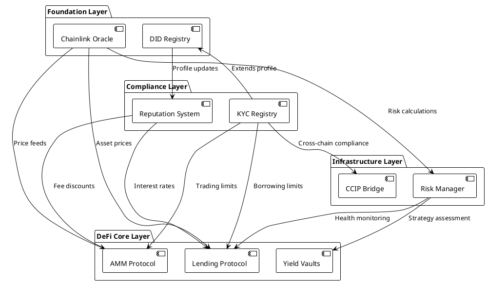
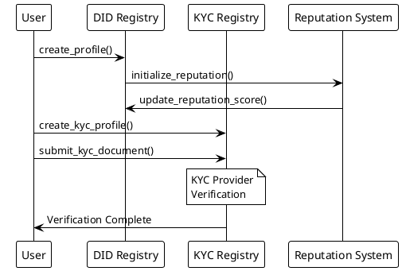
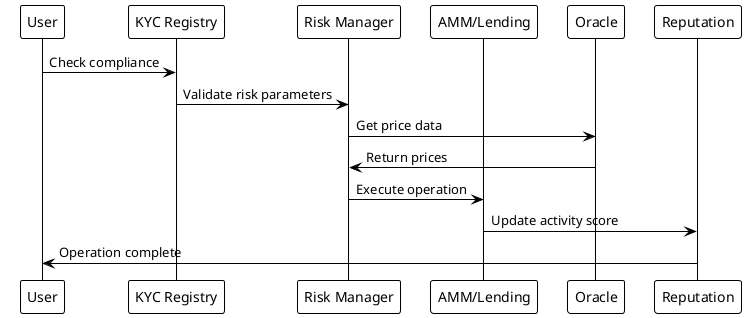

# Smart Contract Architecture

## Overview

AptoFi's smart contract ecosystem consists of 9 comprehensive Move contracts deployed on Aptos blockchain, providing a complete DeFi banking platform with institutional-grade compliance and security features.

## Contract Hierarchy



## Core Contracts

### 1. DID Registry (`did_registry.move`)

**Purpose**: Basic decentralized identity management with reputation integration.

**Key Features**:
- User profile creation and management
- Metadata storage with flexible key-value pairs
- Profile activation/deactivation
- Integration with reputation system
- Admin controls for emergency management

**Core Structures**:
```move
struct UserProfile has key {
    wallet_address: address,
    profile_hash: vector<u8>,
    metadata: Table<String, String>,
    created_at: u64,
    updated_at: u64,
    is_active: bool,
    reputation_score: u64,
}
```

**Entry Functions**:
- `create_profile()` - Create new user profile
- `update_profile()` - Update existing profile
- `deactivate_profile()` - Deactivate user profile
- `admin_deactivate_profile()` - Admin emergency deactivation

**View Functions**:
- `get_profile()` - Retrieve user profile data
- `profile_exists()` - Check if profile exists
- `is_profile_active()` - Check profile status
- `get_total_users()` - Get platform statistics

### 2. KYC Registry (`kyc_did_registry.move`)

**Purpose**: Comprehensive KYC compliance system for regulatory requirements.

**Key Features**:
- Multi-level KYC verification (Basic, Enhanced, Institutional)
- Document storage with IPFS integration
- Biometric verification support
- AML risk scoring and sanctions screening
- Compliance audit trails
- KYC provider management

**Core Structures**:
```move
struct KYCProfile has key {
    wallet_address: address,
    profile_hash: vector<u8>,
    full_name_hash: vector<u8>,
    kyc_level: u8,
    verification_status: u8,
    compliance_status: u8,
    documents: vector<KYCDocument>,
    biometric_data: BiometricData,
    compliance_data: ComplianceData,
    verification_history: vector<VerificationEvent>,
    is_active: bool,
    expires_at: u64,
}
```

**Verification Levels**:
- **Level 0**: No verification (limited access)
- **Level 1**: Basic verification ($10K limits)
- **Level 2**: Enhanced verification ($100K limits)
- **Level 3**: Institutional verification (unlimited)

**Entry Functions**:
- `create_kyc_profile()` - Create KYC profile
- `submit_kyc_document()` - Submit verification documents
- `verify_kyc_profile()` - KYC provider verification
- `register_kyc_provider()` - Register verification provider

**View Functions**:
- `get_kyc_profile()` - Get KYC status
- `get_compliance_data()` - Get compliance information
- `is_kyc_compliant()` - Check compliance for operations
- `check_kyc_compliance()` - Detailed compliance check

### 3. Reputation System (`reputation_system.move`)

**Purpose**: Multi-factor reputation scoring based on on-chain activity.

**Key Features**:
- Dynamic reputation scoring
- Multi-component scoring (transaction, lending, governance)
- Tier-based benefits system
- Historical score tracking
- Integration with DeFi protocols

**Core Structures**:
```move
struct ReputationScore has key {
    user_address: address,
    base_score: u64,
    transaction_score: u64,
    lending_score: u64,
    governance_score: u64,
    total_score: u64,
    last_updated: u64,
}
```

**Scoring Components**:
- **Base Score**: 100 points for new users
- **Transaction Score**: Based on volume and frequency
- **Lending Score**: Based on repayment history
- **Governance Score**: Based on participation

**Entry Functions**:
- `initialize_reputation()` - Initialize user reputation
- `update_transaction_score()` - Update trading activity score
- `update_lending_score()` - Update lending activity score
- `update_governance_score()` - Update governance participation

**View Functions**:
- `get_reputation_score()` - Get complete reputation data
- `get_reputation_tier()` - Get user tier
- `meets_tier_requirement()` - Check tier eligibility

### 4. AMM Protocol (`amm.move`)

**Purpose**: Automated Market Maker for decentralized token trading.

**Key Features**:
- Constant product formula (x * y = k)
- Liquidity pool management
- Fee collection and distribution
- Slippage protection
- Multi-token support

**Core Structures**:
```move
struct LiquidityPool has key {
    token_a_reserve: u64,
    token_b_reserve: u64,
    lp_supply: u64,
    fee_rate: u64,
    token_a_symbol: String,
    token_b_symbol: String,
    created_at: u64,
}
```

**Entry Functions**:
- `create_pool()` - Create new liquidity pool
- `swap_exact_input()` - Execute token swap
- `add_liquidity()` - Add liquidity to pool
- `remove_liquidity()` - Remove liquidity from pool

**View Functions**:
- `get_pool_info()` - Get pool statistics
- `get_swap_quote()` - Calculate swap output
- `get_user_lp_balance()` - Get user LP tokens

### 5. Lending Protocol (`lending_protocol.move`)

**Purpose**: Collateralized lending and borrowing with reputation-based rates.

**Key Features**:
- Over-collateralized lending
- Dynamic interest rates
- Reputation-based rate adjustments
- Liquidation mechanisms
- Multi-asset support

**Core Structures**:
```move
struct Loan has store {
    borrower: address,
    amount: u64,
    collateral_amount: u64,
    interest_rate: u64,
    start_time: u64,
    duration: u64,
    is_active: bool,
    total_repaid: u64,
}
```

**Entry Functions**:
- `create_lending_pool()` - Create lending pool
- `supply_liquidity()` - Supply lending liquidity
- `request_loan()` - Request collateralized loan
- `repay_loan()` - Repay loan with interest

**View Functions**:
- `get_pool_info()` - Get lending pool data
- `get_user_loan()` - Get loan information
- `calculate_loan_health()` - Calculate health factor

### 6. Yield Vaults (`yield_vault.move`)

**Purpose**: Multi-strategy yield farming and optimization.

**Key Features**:
- Multiple yield strategies
- Risk-adjusted returns
- Performance tracking
- Automated rebalancing
- Fee management

**Core Structures**:
```move
struct Vault has key {
    id: u64,
    name: String,
    token_symbol: String,
    total_deposits: u64,
    total_shares: u64,
    strategy_type: u8,
    performance_fee: u64,
    is_active: bool,
}
```

**Strategy Types**:
- **Lending Strategy**: Deposit in lending protocols
- **LP Strategy**: Provide liquidity for fees
- **Staking Strategy**: Stake tokens for rewards

**Entry Functions**:
- `create_vault()` - Create new yield vault
- `deposit()` - Deposit tokens to vault
- `withdraw()` - Withdraw tokens from vault
- `harvest_rewards()` - Harvest and compound rewards

**View Functions**:
- `get_vault_info()` - Get vault statistics
- `get_user_position()` - Get user vault position
- `calculate_vault_apy()` - Calculate current APY

### 7. Risk Manager (`risk_manager.move`)

**Purpose**: Comprehensive risk assessment and liquidation management.

**Key Features**:
- Real-time health factor monitoring
- Market risk assessment
- Liquidation queue management
- Risk-based limits
- Oracle price validation

**Core Structures**:
```move
struct PositionRisk has store {
    user: address,
    collateral_value: u64,
    debt_value: u64,
    health_factor: u64,
    liquidation_price: u64,
    last_calculated: u64,
}
```

**Entry Functions**:
- `update_market_risk()` - Update market risk parameters
- `update_position_risk()` - Update user position risk
- `update_risk_parameters()` - Admin risk parameter updates

**View Functions**:
- `calculate_health_factor()` - Calculate position health
- `check_liquidation_eligibility()` - Check liquidation status
- `get_safe_borrow_amount()` - Calculate safe borrowing limit
- `get_liquidation_queue()` - Get liquidation candidates

### 8. Chainlink Oracle (`chainlink_oracle.move`)

**Purpose**: Reliable price feeds and external data integration.

**Key Features**:
- Multiple price feed support
- Price staleness validation
- Deviation threshold monitoring
- Admin-controlled feed management
- Fallback mechanisms

**Core Structures**:
```move
struct PriceFeed has store {
    price: u64,
    timestamp: u64,
    decimals: u8,
    is_active: bool,
}
```

**Entry Functions**:
- `register_price_feed()` - Register new price feed
- `update_price()` - Update price data
- `deactivate_feed()` - Deactivate price feed

**View Functions**:
- `get_latest_price()` - Get current price
- `get_price_safe()` - Get price with staleness check
- `is_price_fresh()` - Check price freshness
- `calculate_usd_value()` - Convert to USD value

### 9. CCIP Bridge (`ccip_bridge.move`)

**Purpose**: Cross-chain interoperability using Chainlink CCIP.

**Key Features**:
- Cross-chain token transfers
- Cross-chain message passing
- Multi-chain DeFi operations
- Compliance verification across chains
- Fee estimation and management

**Core Structures**:
```move
struct CrossChainTransfer has store {
    id: u64,
    sender: address,
    recipient: String,
    token: String,
    amount: u64,
    destination_chain: u64,
    status: u8,
    ccip_message_id: vector<u8>,
}
```

**Supported Chains**:
- Ethereum (Chain Selector: 5009297550715157269)
- Polygon (Chain Selector: 4051577828743386545)
- Avalanche (Chain Selector: 6433500567565415381)
- Arbitrum (Chain Selector: 4949039107694359620)

**Entry Functions**:
- `initiate_cross_chain_transfer()` - Start cross-chain transfer
- `send_cross_chain_message()` - Send cross-chain message
- `initiate_cross_chain_swap()` - Cross-chain token swap
- `add_supported_chain()` - Add new supported chain

**View Functions**:
- `get_supported_chains()` - Get supported chain list
- `get_transfer_status()` - Get transfer status
- `estimate_cross_chain_fee()` - Estimate transfer fees

## Contract Interactions

### User Onboarding Flow



### DeFi Operation Flow



## Security Features

### Access Control

1. **Role-Based Access**
   - Admin functions restricted to deployer
   - KYC provider functions restricted to registered providers
   - User functions restricted to profile owners

2. **Emergency Controls**
   - Global pause mechanisms
   - Emergency profile deactivation
   - Risk parameter emergency updates

3. **Input Validation**
   - Comprehensive parameter validation
   - Overflow/underflow protection
   - Reentrancy protection

### Risk Management

1. **Health Factor Monitoring**
   - Real-time position health calculation
   - Automated liquidation triggers
   - Risk-based borrowing limits

2. **Oracle Security**
   - Price staleness validation
   - Deviation threshold monitoring
   - Multiple oracle source support

3. **Compliance Enforcement**
   - KYC level verification before operations
   - Transaction limit enforcement
   - Sanctions screening integration

## Gas Optimization

### Efficient Data Structures

- **Tables**: Used for large collections (O(1) access)
- **Vectors**: Used for ordered lists and history
- **Simple Maps**: Used for small key-value pairs
- **Events**: Used for off-chain indexing

### Batch Operations

- Multiple metadata updates in single transaction
- Batch liquidations for efficiency
- Grouped oracle updates

### Storage Optimization

- Minimal on-chain storage
- IPFS for large documents
- Compressed data structures
- Efficient packing of struct fields

## Testing Strategy

### Unit Tests

Each contract includes comprehensive unit tests covering:
- Happy path scenarios
- Edge cases and error conditions
- Access control validation
- Mathematical calculations
- State transitions

### Integration Tests

Cross-contract interaction testing:
- DID → Reputation integration
- KYC → DeFi protocol integration
- Oracle → Risk management integration
- Cross-chain compliance flows

### Security Testing

- Reentrancy attack prevention
- Integer overflow/underflow protection
- Access control bypass attempts
- Emergency scenario handling

## Deployment Configuration

### Network Configuration

```toml
[addresses]
aptofi = "927e781adeb2252f56f4b7f9de423bda7402954ee7adb3baa1d766509d494f3c"

[dependencies.AptosFramework]
git = "https://github.com/aptos-labs/aptos-core.git"
rev = "mainnet"
subdir = "aptos-move/framework/aptos-framework"
```

### Contract Addresses (Testnet)

All contracts deployed at base address: `0x927e781adeb2252f56f4b7f9de423bda7402954ee7adb3baa1d766509d494f3c`

- `did_registry`: `0x927e781adeb2252f56f4b7f9de423bda7402954ee7adb3baa1d766509d494f3c::did_registry`
- `kyc_did_registry`: `0x927e781adeb2252f56f4b7f9de423bda7402954ee7adb3baa1d766509d494f3c::kyc_did_registry`
- `reputation_system`: `0x927e781adeb2252f56f4b7f9de423bda7402954ee7adb3baa1d766509d494f3c::reputation_system`
- `amm`: `0x927e781adeb2252f56f4b7f9de423bda7402954ee7adb3baa1d766509d494f3c::amm`
- `lending_protocol`: `0x927e781adeb2252f56f4b7f9de423bda7402954ee7adb3baa1d766509d494f3c::lending_protocol`
- `yield_vault`: `0x927e781adeb2252f56f4b7f9de423bda7402954ee7adb3baa1d766509d494f3c::yield_vault`
- `risk_manager`: `0x927e781adeb2252f56f4b7f9de423bda7402954ee7adb3baa1d766509d494f3c::risk_manager`
- `chainlink_oracle`: `0x927e781adeb2252f56f4b7f9de423bda7402954ee7adb3baa1d766509d494f3c::chainlink_oracle`
- `ccip_bridge`: `0x927e781adeb2252f56f4b7f9de423bda7402954ee7adb3baa1d766509d494f3c::ccip_bridge`

## Future Enhancements

### Planned Features

1. **Zero-Knowledge KYC**
   - Privacy-preserving identity verification
   - Selective disclosure protocols
   - Enhanced user privacy

2. **Advanced Yield Strategies**
   - AI-powered strategy optimization
   - Cross-protocol yield farming
   - Dynamic rebalancing algorithms

3. **Governance System**
   - Decentralized protocol governance
   - Proposal and voting mechanisms
   - Treasury management

4. **Insurance Protocol**
   - Smart contract insurance
   - Liquidation insurance
   - Protocol risk coverage

### Scalability Improvements

1. **Batch Processing**
   - Multi-user liquidations
   - Batch oracle updates
   - Grouped transaction processing

2. **State Optimization**
   - Data compression techniques
   - Efficient storage patterns
   - Minimal on-chain footprint

3. **Cross-Chain Expansion**
   - Additional blockchain support
   - Multi-chain liquidity aggregation
   - Unified cross-chain governance

This smart contract architecture provides a robust foundation for institutional-grade DeFi banking while maintaining security, compliance, and scalability.